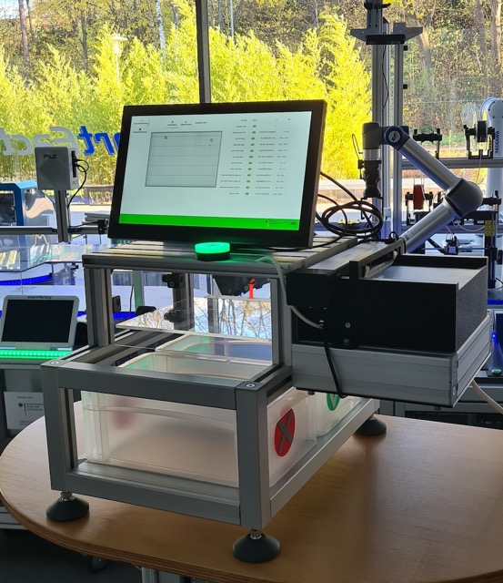

<a name="readme-top"></a>

<div align="center">
  <h1 align="center">AI-textile-quality-assurance</h1>

<a href="https://github.com/Green-AI-Hub-Mittelstand/AI-textile-quality-assurance/issues">Report Bug</a>
·
<a href="https://github.com/Green-AI-Hub-Mittelstand/AI-textile-quality-assurance/issues">Request Feature</a>

  <br>

  <a href="https://www.green-ai-hub.de">
    
  </a>
  <br>
  <h3 align="center"><strong>Green-AI Hub Mittelstand</strong></h3>
  <a href="https://www.green-ai-hub.de"><u>Homepage</u></a> 
  | 
  <a href="https://www.green-ai-hub.de/kontakt"><u>Contact</u></a>

</div>

## About the project

This project focuses on an innovative, cost-effective, and accessible
AI-driven quality control test bench solution tailored for the textile industry,
specifically designed for small and medium-sized enterprises.
By utilizing readily available consumer hardware and cutting-edge AI techniques,
the system delivers highly accurate quality control without requiring substantial financial investment.
The goal of this approach is to enable small and medium-sized businesses to adopt and
implement advanced automated quality control at a fraction of the cost.
Its effectiveness has been demonstrated through the successful Köstler GAIH pilot project.



<a name="table-of-contents"></a>

## Table of Contents

<ol>
  <li><a href="#about-the-project">About The Project</a></li>
  <li><a href="#table-of-contents">Table of Contents</a></li>
  <li>
    <a href="#getting-started">Getting Started</a>
    <ul>
      <li><a href="#installation">Installation</a></li>
    </ul>
  </li>
  <li><a href="#usage">Usage</a></li>
  <li><a href="#development">Development</a></li>
  <li><a href="#contributing">Contributing</a></li>
  <li><a href="#ai_models">AI Models</a></li>
  <li><a href="#license">License</a></li>
  <li><a href="#contact">Contact</a></li>
</ol>


<a name="getting-started"></a>

## Getting Started

Clone this repository, navigate with your terminal into this repository and execute the following steps.
We had to remove the auto-encoder model, because the file was to large. But you can train a new model wth your own data images, see <a href="#ai_models">AI Models</a>.

<a name="installation"></a>

### Installation

Requires fairly recent Python version, **3.12** for example. Clone this repo somewhere, and make the `main.py` file executable.
On Ubuntu, you need to create a virtual environment to be able to install all required dependencies with pip.

```
pip install -r requirements.txt
chmod +x main.py
```

<a name="usage"></a>

## Usage

Access to the scanner and the serial port requires higher access rights, hence start this program with sudo as follows:

```
sudo ./main.py
```

<a name="contributing"></a>

<a name="usage"></a>

<a name="development"></a>

## Development

Add some scans (png format) to the dummy_scans folder.
The `main.py` can also be started in a dummy mode, not requiring a scanner or serial port. To do so start it as follows:

```
python main.py --dummy
```

<a name="contributing"></a>

## Contributing

Contributions are what make the open source community such an amazing place to learn, inspire, and create. Any
contributions you make are **greatly appreciated**.

If you have a suggestion that would make this better, please fork the repo and create a pull request. You can also
simply open an issue with the tag "enhancement".
Don't forget to give the project a star! Thanks again!

1. Fork the Project
2. Create your Feature Branch (`git checkout -b feature/AmazingFeature`)
3. Commit your Changes (`git commit -m 'Add some AmazingFeature'`)
4. Push to the Branch (`git push origin feature/AmazingFeature`)
5. Open a Pull Request

<p align="right">(<a href="#readme-top">back to top</a>)</p>


<a name="ai_models"></a>

## AI Models

### Train Error-Detector (transfer-learning)

This script trains a binary classifier to differentiate between error-free and error-containing images. The image
patches are resized to 224x224 pixels and normalized by centering and scaling pixel values to the range [-1, 1].
An R50V2 model, pre-trained on ImageNet, is used as a fixed feature extractor, and a custom classifier is trained on the
extracted features.
The used network architecture is:

| Layer                | Operation              | Activation |
|----------------------|------------------------|------------|
| Backbone             | ResNet50v2             | -          |
| GlobalAveragePooling | GlobalAveragePooling2D | -          |
| Dense1               | Dense                  | ReLU       |
| Dropout1             | Dropout                | ReLU       |
| Dense2               | Dense                  | ReLU       |
| Dropout2             | Dropout                | ReLU       |
| Dense3               | Dense                  | Softmax    |

### Train script homology feature:

This script trains a binary random forest classifier using persistent homology as input features.
Images are converted to black and white, and their persistence diagrams are computed to capture the birth and death of
topological features, such as path-connected components (H<sub>0</sub>) and loops (H<sub>1</sub>).

For this implementation, the H<sub>1</sub> (loops) portion of the persistence diagram is transformed into a 50x50 grayscale image,
which is then used to train the random forest classifier in place of the original images.

<br>
  <a href="https://www.mdpi.com/2075-1680/11/3/112"><strong>Interested in homology? »</strong></a>
<br>

### Train auto encoder

U-Net-based autoencoder architecture is used, where the encoder compresses input images into a low-dimensional latent
space, and the decoder reconstructs the images from this compressed representation.
Since the model is trained exclusively on error-free data, it encounters difficulty reconstructing images containing
errors, making the reconstruction error a reliable metric for detecting anomalies. <br>
In this script, 256x256 pixel patches are used as training data. To enhance the dataset, random portions of each input
are blurred during augmentation, while the corresponding output remains unaltered.
The used network architecture is:

| Layer  | Operation        | Activation |
|--------|------------------|------------|
| Conv1  | Conv2D           | ReLU       |
| Conv2  | Conv2D           | ReLU       |
|        |                  |            |
| Conv5  | Conv2D           | ReLU       |
| Tran1  | Conv2D Transpose | ReLU       |
| Tran2  | Conv2D Transpose | ReLU       |
|        |                  |            |
| Tran4  | Conv2D Transpose | ReLU       |
| Output | Conv2D Transpose | Tanh       |


<a name="license"></a>

## License

Distributed under the GPL-3.0 license. See `LICENSE.txt` for more information. </br>
Check the external libraries used in the application:

| Libary        | License          |
|---------------|------------------|
| numpy         | BSD              |
| opencv        | Apache-2         |
| pandas        | BSD-3-Clause     |
| nicegui       | MIT              |
| tensorflow    | Apache-2         |
| joblib        | BSD-2-Clause     |
| gudhi         | MIT, GPLv3, LGPL |
| pillow        | MIT-CMU          |
| pywebview     | BSD-3-Clause     |
| torch         | BSD-3-Clause     |
| torchvision   | BSD-3-Clause     |
| Flask         | BSD-3-Clause     |
| Flask-RESTful | BSD              |
| aiohttp       | Apache-2         |
| scikit-learn  | BSD-3-Clause     |
| matplotlib    | PPSF-2.0         |
| pyserial      | BSD              |
| python-sane   | BSD-3-Clause     |

<p align="right">(<a href="#readme-top">back to top</a>)</p>

## Hardware
The hardware documentation is located [here](hardware/README.md).


<a name="contact"></a>

## Contact

Green-AI Hub Mittelstand - info@green-ai-hub.de

Project Link: https://github.com/Green-AI-Hub-Mittelstand/AI-textile-quality-assurance

<br>
  <a href="https://www.green-ai-hub.de/kontakt"><strong>Get in touch »</strong></a>
<br>

<p align="left">
  <a href="https://www.green-ai-hub.de">
    
  </a>
</p>


<p align="right">(<a href="#readme-top">back to top</a>)</p>

